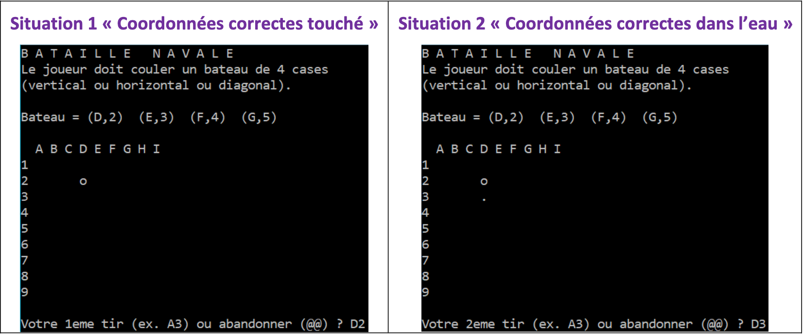
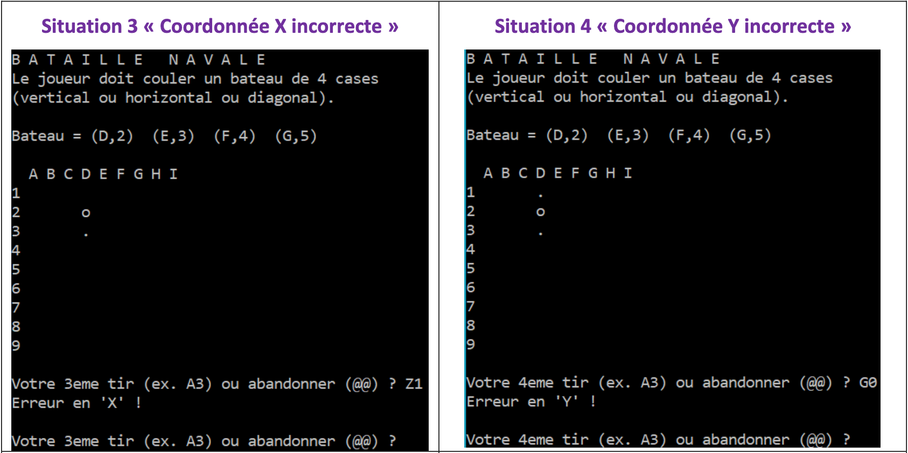
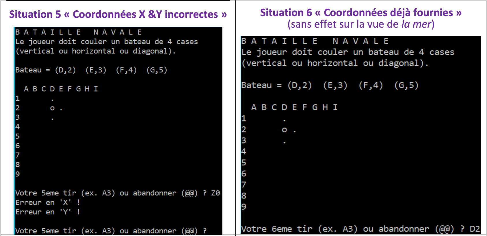
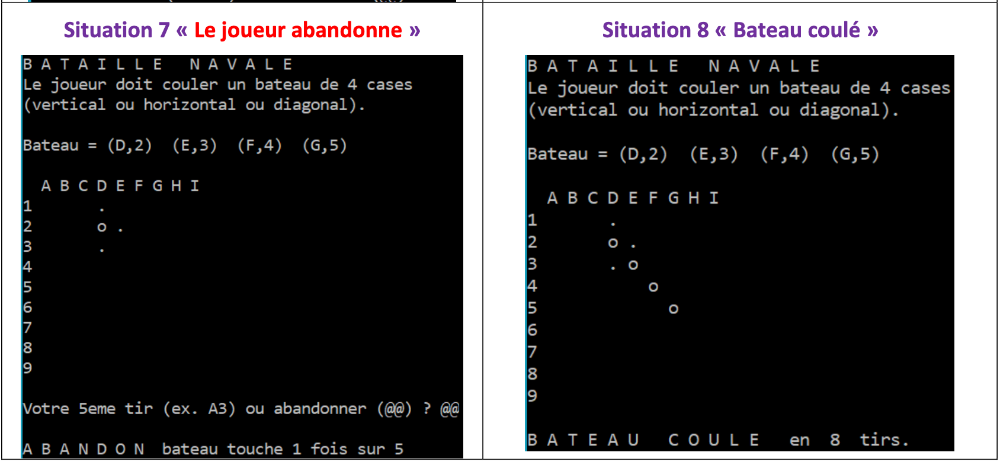

    <h2>Bataille navale</h2>

### 1. Description du jeu 
> Le  joueur doit  couler  un  bateau  composé de  quatre cases alignées. 
> A chaque tir le joueur est informé par « dans l’eau » ou bien par « touché ». 
> La partie se termine lorsque le bateau est « coulé » ; à  savoir, lorsque les quatre cases consécutives qu’il occupe horizontalement, verticalement ou bien diagonalement, sont touchée

#### 2. Spécification du besoin 
> - Les règles du jeu sont toujours visibles 
> - Les coordonnées du bateau à couler (et donc son orientation horizontale, verticale, diagonale) sont définies au hasard par le jeu et ne changent pas durant la partie. 
> - Pour faciliter la correction, les coordonnées du bateau à couler sont affichées 
> - Le nombre de tirs est communiqué à chaque coup 
> - A chaque coup, le joueur saisit les coordonnées voulues pour son tir (x,y)  ε  { A..I } x { 1..9 }  
> - Les valeurs des coordonnée saisies sont vérifiées avec les messages d’erreur correspondants 
> - Les tirs dans l’eau (cf. ‘.’) sont différenciés des tirs qui touchent le bateau (cf. ‘o’)
<a> À tout instant, le joueur peur abandonner.</a>

#### 3. Exemples de situations à satisfaire 
###### Notes
> Chaque écran correspond à une exécution différente du même jeu. 
> Coordonnées saisies et résultat obtenu sont artificiellement réunis sur le même écran.

#### 4. Ressources à disposition 
Le module `game-tools`
> Ce module utilisé pour ce projet a été créé par Tom PLANCHE, @TomPlanche sur GitHub.
> Ce module met à disposition des fonctionnalités simples permettant d’effacer le terminal, de mettre le programme en pause, d’afficher des éléments en couleur ou encore de générer un nombre entier aléatoire.
<a>Il est utilisable sur Windows, MacOS et Linux.</a>

